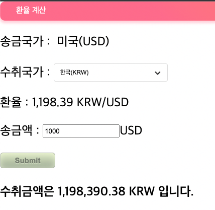

# 환율 계산 API

### 언어
Spring Boot

### 개발 환경
- Java 11
- Spring Boot 2.6.3
- Thymeleaf, JS, jQuery

### 기능 구현
[ V ] 프론트엔트 화면 개발  
[ V ] 환율 정보 API 연동  
[ V ] 수취 금액 계산  
[ V ] 공통 예외 처리  
[ V ] 공통 Validation 처리  

